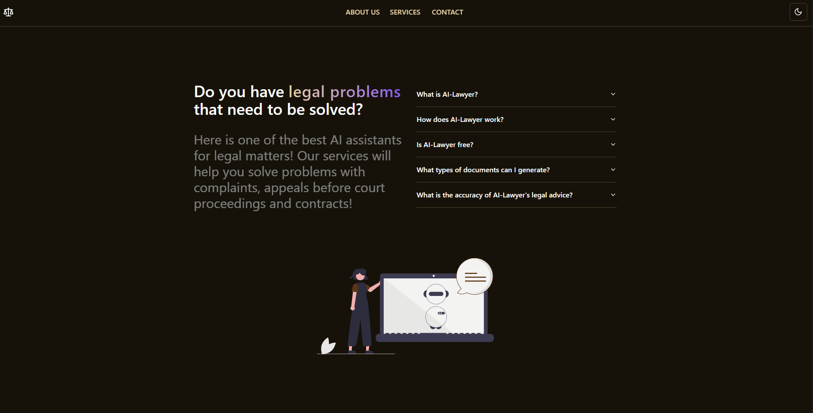

# AI Legal Assistant

A modern, intelligent legal document generation and management system built with Next.js, React, and TypeScript. This application helps users create and modify legal documents using AI-powered assistance.

## 🖼️ Project Screenshot




## 🚀 Features

- **AI-Powered Document Generation**: Generate legal documents based on user inputs
- **Document Types**: Support for Lawsuits and Pre-litigation Appeals
- **Interactive Document Editing**: Select and modify specific parts of generated documents
- **File Upload Support**: Upload evidence documents (PDF, text files)
- **Real-time Validation**: Form validation with helpful error messages
- **Responsive Design**: Works seamlessly on desktop and mobile devices
- **Dark/Light Theme**: Toggle between dark and light themes
- **Modern UI**: Built with Tailwind CSS and shadcn/ui components

## 🛠️ Tech Stack

- **Framework**: Next.js 14 with App Router
- **Language**: TypeScript
- **Styling**: Tailwind CSS
- **UI Components**: shadcn/ui
- **Form Handling**: React Hook Form with Zod validation
- **HTTP Client**: Axios
- **Icons**: Lucide React
- **Theme**: next-themes

## 📋 Prerequisites

Before running this project, make sure you have the following installed:

- Node.js (version 18 or higher)
- npm or yarn package manager

## 🚀 Getting Started

### 1. Clone the Repository

```bash
git clone <repository-url>
cd ai-legal-assistant
```

### 2. Install Dependencies

```bash
npm install
# or
yarn install
```

### 3. Run the Development Server

```bash
npm run dev
# or
yarn dev
```

Open [http://localhost:3000](http://localhost:3000) with your browser to see the result.

### 4. Build for Production

```bash
npm run build
# or
yarn build
```

### 5. Start Production Server

```bash
npm start
# or
yarn start
```

## 📁 Project Structure

```
ai-legal-assistant/
├── src/
│   ├── app/
│   │   ├── api/           # API routes
│   │   ├── globals.css    # Global styles
│   │   ├── layout.tsx     # Root layout
│   │   ├── page.tsx       # Home page
│   │   └── not-found.tsx  # 404 page
│   ├── components/
│   │   ├── forms/         # Form components
│   │   ├── hero/          # Hero section
│   │   ├── navigation/    # Navigation component
│   │   ├── section-divider/
│   │   ├── section-heading/
│   │   ├── theme/         # Theme components
│   │   └── ui/            # UI components
│   ├── lib/               # Utility functions
│   └── providers/         # Context providers
├── public/                # Static assets
├── package.json
├── tailwind.config.ts
└── README.md
```

## 🎯 Key Features Explained

### Document Generation
- Users can select document type (Lawsuit or Pre-litigation Appeal)
- Input legal topic and case details
- Upload supporting evidence documents
- AI generates comprehensive legal documents

### Document Editing
- Interactive text selection for targeted modifications
- Real-time document updates
- Maintains document structure and formatting

### File Management
- Support for PDF and text file uploads
- Secure file handling with base64 encoding
- File type validation

## 🔧 Configuration

### Environment Variables
Create a `.env.local` file in the root directory:

```env
# Add your environment variables here
NEXT_PUBLIC_API_URL=your_api_url_here
```

### API Endpoints
The application expects the following API endpoints:

- `POST /api/generation` - Generate legal documents
- `POST /api/correction` - Update existing documents

## 🎨 Customization

### Styling
The project uses Tailwind CSS for styling. You can customize the design by modifying:

- `tailwind.config.ts` - Tailwind configuration
- `src/app/globals.css` - Global styles
- Component-specific CSS classes

### Themes
The application supports dark and light themes. Theme configuration is handled in:

- `src/providers/theme-provider.tsx`
- `src/components/theme/mode-toggle.tsx`

## 📱 Responsive Design

The application is fully responsive and optimized for:
- Desktop (1024px and above)
- Tablet (768px - 1023px)
- Mobile (below 768px)

## 🧪 Testing

```bash
# Run linting
npm run lint

# Run type checking
npx tsc --noEmit
```

## 🚀 Deployment

### Vercel (Recommended)
1. Push your code to GitHub
2. Connect your repository to Vercel
3. Deploy automatically

### Other Platforms
The application can be deployed to any platform that supports Next.js:
- Netlify
- Railway
- DigitalOcean App Platform
- AWS Amplify

## 🤝 Contributing

1. Fork the repository
2. Create a feature branch (`git checkout -b feature/amazing-feature`)
3. Commit your changes (`git commit -m 'Add some amazing feature'`)
4. Push to the branch (`git push origin feature/amazing-feature`)
5. Open a Pull Request

## 📄 License

This project is licensed under the MIT License - see the [LICENSE](LICENSE) file for details.

## 🙏 Acknowledgments

- Built with [Next.js](https://nextjs.org/)
- UI components from [shadcn/ui](https://ui.shadcn.com/)
- Icons from [Lucide React](https://lucide.dev/)
- Styling with [Tailwind CSS](https://tailwindcss.com/)

## 📞 Support

If you have any questions or need support, please open an issue in the GitHub repository.

---

**Note**: This application is for educational and demonstration purposes. For actual legal advice, please consult with qualified legal professionals.
